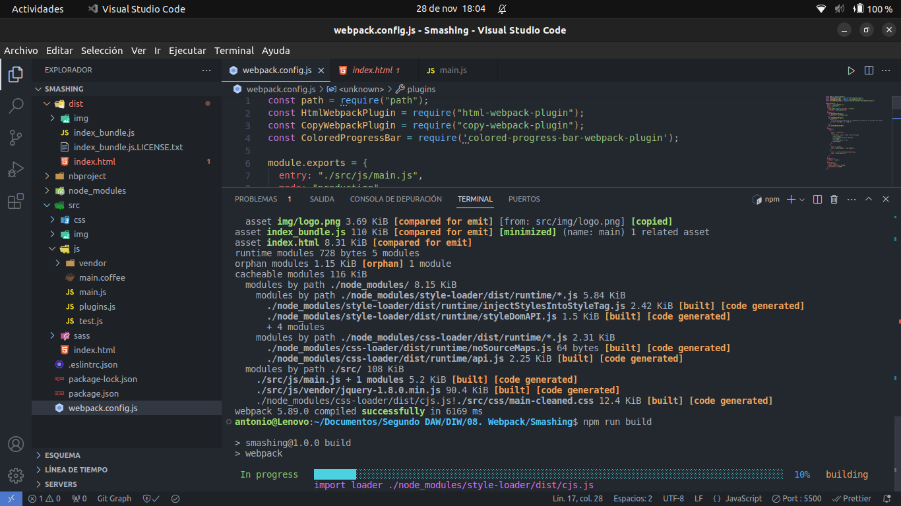

# A

Como en Linux al introducir el comando que inicia la página no va bien aquí está la respuesta:

Voy al archivo package.json y miro los scripts que hay.

Hay uno que se ejecuta en modo producción: "production": "webpack --config configuration/webpack/webpack.prod.config.js --mode=production",

Así que lo que haría sería: npm run production.

---

# B

Los plugins que está utilizando son los siguientes:

- ImageMinimizerPlugin: Es un plugin que minimiza las imagenes para subirlas a producción y que pesen menos.
- MiniCssExtractPlugin: Crea un archivo JS (que contiene CSS) para cada archivo CSS.
- CopyWebpackPlugin: PLugin que sirve para copiar archivos de una ruta a otra.
- HTMLWebpackPlugin: Plugin que sirve para generar el archivo html en la carpeta dist
- CleanWebpackPlugin: PLugin para "limpiar" "minimizar" el archivo html que va a subir se a producción. A día de hoy ya el propio plugin HTMLWebpackPlugin ya tiene una opción de Clean y no es necesario usar este plugin.

---

# C

Lo primero que habría que hacer es instalar el plugin en el proyecto de webpack mediante el comando:

~~~
npm install --save-dev mini-css-extract-plugin
~~~

Y si ahora en el archivo de configuración de webpack habría que poner lo siguiente:

~~~
new MiniCssExtractPlugin({
  linkType = "text/css",
  insert: function (linkType) {
    var reference = document.querySelector("#ciutats");
    if (reference) {
      reference.parentNode.insertBefore(linkType, reference);
    }
  },
});
~~~

---

# D

El plugin lo que hace es generar barras de carga de colores, para probarlo ya que este proyecto en Linux no funciona he usado el Smashing.

Lo instalo y ejecuto el comando npm run build y obtengo el siguiente output en la terminal:

