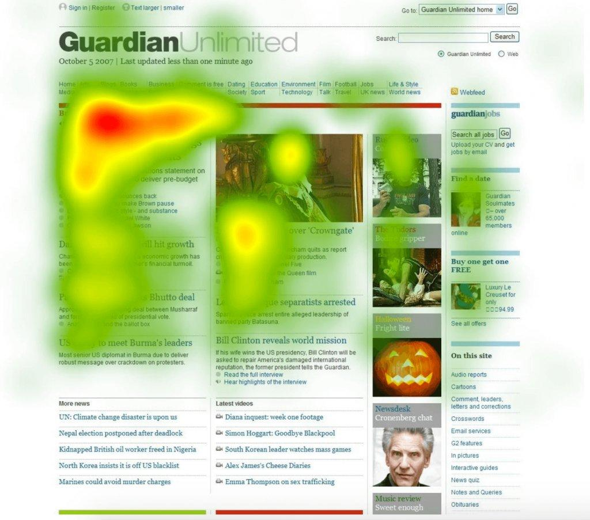

# Ejercicio Usability

Cita 5 características que podríamos extraer sobre el siguiente mapa de calor.

1. La inmensa mayoría de usuarios clickan siempre en la primera noticia que les aparece en la parte superior izquierda de la feed, los enlances que hay debajo de ésta y las fotos de la página, cuanto más a la derecha están menos se clicka.

2. La mayoría de los usuarios hace caso omiso a las secciones de **"Latest videos"** y **"More news"**.

3. En lo que respecta al buscador nadie se digna a usarlo.

4. Hay más usuarios que le hacen click encima del botón de registrarse que de iniciar sesión.

5. La sección donde aparece una lista de categorias de noticias se usa principalmente la parte de la izquierda, la parte derecha tiene una menor atención de los usuarios.

6. Mucha gente clicka encima del logo para volver a la página principal.
